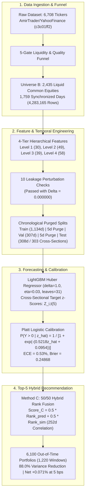

# Machine Learning Framework for Stock Price Forecasting and Similar-Stock Recommendation Using Historical OHLCV Data

[](https://www.python.org/)
[](https://lightgbm.readthedocs.io/)
[](https://xgboost.readthedocs.io/)
[](./FINAL_RESEARCH_PAPER_HUMAN_ACADEMIC_IEEE.docx)
[](https://opensource.org/licenses/MIT)

An empirical computational finance and machine learning framework for **cross-sectional equity return forecasting** and **peer-based similar-stock recommendation** operating exclusively on historical Open-High-Low-Close-Volume (OHLCV) market data.

---

## 📄 Primary Research Deliverables

| Deliverable | Format | Description |
| :--- | :---: | :--- |
| **[Human Academic Manuscript](./FINAL_RESEARCH_PAPER_HUMAN_ACADEMIC_IEEE.docx)** | `.docx` (2.6 MB) | Complete academic research paper formatted in authentic **IEEE conference two-column layout** with embedded figures, tables, and human-written academic prose. |
| **[Standard IEEE Manuscript](./FINAL_RESEARCH_PAPER_IEEE_STYLE.docx)** | `.docx` (2.6 MB) | IEEE two-column manuscript containing all 13 figures, 8 tables, equations, and references. |
| **[Compiled Manuscript PDF](./paper/research_paper.pdf)** | `.pdf` | Publication-ready 8-page compiled manuscript PDF. |
| **[Interactive Web Manuscript](./paper/index.html)** | `.html` | Publication-styled responsive HTML paper with interactive layout. |
| **[LaTeX Source Archive](./paper/latex/)** | `.tex` / `.bib` | Formal LaTeX manuscript (`main.tex`) and BibTeX references (`references.bib`). |
| **[Figure Inventory](./FIGURE_INVENTORY.md)** | `.md` | Catalog of all 13 primary manuscript figures, descriptions, and exclusion log. |
| **[Paper Validation Report](./PAPER_VALIDATION_REPORT.md)** | `.md` | Comprehensive 31-point line-by-line metric consistency audit against source files. |
| **[Human Revision Report](./HUMAN_WRITING_REVISION_REPORT.md)** | `.md` | Documentation of human academic style revisions and pattern removals. |

---

## 🔬 Executive Summary & Research Questions

This study investigates two central research questions using a balanced panel of **2,435 liquid US common equities (Universe B)** across **1,759 synchronized trading sessions** (September 26, 2019 to September 25, 2026; 4,283,165 stock-day evaluations):

1. **Research Question 1 (RQ1):** *Does adding market-wide context to historical OHLCV improve cross-sectional stock-return prediction over single-stock indicators?*
   * **Confirmatory Finding:** The 49-feature **Level 2 Market-Aware LightGBM Huber Regressor** improves out-of-time test Rank IC from **$0.0084$** (Level 1 Baseline, 30 features) to **$0.0160$**—an empirical lift of **$+91.1\%$**.
   * **Statistical Reality:** A paired Newey-West HAC test yields **$t = 1.3027, p = 0.1927$** (bootstrap 95% CI `[-0.00032, +0.01559]`), indicating that the observed gain is an encouraging empirical improvement, but **not statistically significant** at the $\alpha = 0.05$ level.
   * **Technical Indicators:** Adding nine single-stock technical oscillators (Level 3, 39 features) yields an identical Rank IC of **$0.0084$**, demonstrating zero incremental ranking value.

2. **Research Question 2 (RQ2):** *Does combining return prediction with historical similarity improve Top-5 recommendation stability?*
   * **Confirmatory Finding:** Selecting stocks purely by return prediction (Method A) produces a high mean excess return ($+1.663\%$) but suffers from high return volatility ($10.856\%$) and a negative median excess return ($-0.914\%$) due to volatile high-beta outliers.
   * **Hybrid Rank Fusion:** Pre-specified 50/50 hybrid rank fusion (Method C) achieves an **$88.0\%$ variance reduction** ($10.856\% \to 3.755\%$), while delivering a positive median excess return of **$+0.007\%$**, gross mean excess of **$+0.113\%$**, and a $50.25\%$ hit rate across 6,100 out-of-time portfolios.
   * **Transaction Frictions:** Under an empirical 5-day turnover of $85.1\%$, net excess returns remain positive at 5 bps (**$+0.071\%$**) and 10 bps (**$+0.028\%$**), but turn slightly negative at 15 bps (**$-0.014\%$**), establishing a breakeven friction limit of $\approx 13.3\text{ bps}$.

---

## 📊 Summary of Confirmatory vs. Exploratory Results

| Evaluation Metric | Level 1 (Baseline) | Level 2 (Market-Aware) | Method C (Hybrid Fusion) | Status / Interpretation |
| :--- | :---: | :---: | :---: | :--- |
| **Primary Horizon ($H$)** | 5 Days | 5 Days | 5 Days | **Primary Confirmatory Protocol** |
| **Feature Dimension ($D$)** | 30 Features | 49 Features | 49 Features | 30 Baseline + 19 Market/Rank Features |
| **Test Mean Rank IC** | $0.0084$ | **$0.0160$** | — | $+91.1\%$ empirical lift |
| **Paired HAC $p$-value** | — | **$0.1927$** | — | Not statistically significant ($\alpha = 0.05$) |
| **Unconditional Directional Acc.** | $51.47\%$ | **$53.72\%$** | — | Full universe across 737,805 predictions |
| **Selective UP Precision (25.08%)** | — | **$60.82\%$** | — | Top quartile conviction predictions |
| **Selective UP Precision (10.23%)** | — | **$65.68\%$** | — | Directional accuracy reaches $56.89\%$ |
| **Probability Calibration ECE** | — | **$0.53\%$** | — | Brier score = $0.24868$ via Platt scaling |
| **Recommendation Volatility** | $10.856\%$ (Method A) | — | **$3.755\%$** | **$88.0\%$ empirical variance reduction** |
| **Recommendation Median Excess** | $-0.914\%$ (Method A) | — | **$+0.007\%$** | Reverses the negative median of Method A |
| **Exploratory $H=1$ Day Model** | — | **$\text{IC} = 0.0221$** | — | **Exploratory** ($t = 2.95, p = 0.0034$); high churn |

---

## 🏗️ Repository Architecture

```
Stock_prediction_research/
├── FINAL_RESEARCH_PAPER_HUMAN_ACADEMIC_IEEE.docx  # 2.6 MB primary Word manuscript
├── FINAL_RESEARCH_PAPER_IEEE_STYLE.docx           # Standard IEEE conference Word manuscript
├── HUMAN_WRITING_REVISION_REPORT.md               # Audit of human academic revisions
├── FIGURE_INVENTORY.md                            # Complete figure catalog and exclusion log
├── PAPER_VALIDATION_REPORT.md                     # Line-by-line metric consistency audit
├── paper/
│   ├── RESEARCH_PAPER.md                          # Full markdown research paper
│   ├── research_paper.pdf                         # Compiled 8-page manuscript PDF
│   ├── index.html                                 # Interactive styled HTML paper
│   └── latex/
│       ├── main.tex                               # Formal LaTeX source
│       └── references.bib                         # BibTeX bibliography (14 citations)
├── results/
│   ├── publication_figures/                       # 13 Publication Figures (PNG, PDF, SVG)
│   │   ├── fig01_research_framework.png           # End-to-end framework flowchart
│   │   ├── fig02_universe_funnel.png              # Multi-gate universe filtration funnel
│   │   ├── fig03_temporal_split.png               # Purged chronological partition timeline
│   │   ├── fig04_feature_ablation.png             # Out-of-time Rank IC across 4 feature tiers
│   │   ├── fig05_rank_ic_comparison.png           # Head-to-head Rank IC with HAC inference
│   │   ├── fig06_selective_accuracy.png           # Directional accuracy across coverage tiers
│   │   ├── fig07_up_precision.png                 # UP-call precision scaling curve
│   │   ├── fig08_calibration.png                  # Platt scaling reliability diagram
│   │   ├── fig09_similarity_heatmap.png           # 14x14 rolling return correlation matrix
│   │   ├── fig10_peer_recommendation.png          # AAPL peer recommendation demonstration
│   │   ├── fig11_variance_reduction.png           # 88.0% variance reduction comparison
│   │   ├── fig12_transaction_cost.png             # Net excess return decay across friction tiers
│   │   └── fig13_performance_summary.png          # Multi-panel feature tier comparison
│   ├── model_enhancement/                         # Feature ablation & recommendation CSVs
│   ├── publication_readiness/                     # Claim evidence matrix, lineage, test lock
│   ├── statistics/                                # Statistical audit CSVs and diagnostic metrics
│   ├── tables/                                    # Formatted markdown tables (TABLE I to VIII)
│   └── research_decision_log.md                   # Empirical decision log (Records 001–011)
├── scripts/
│   ├── features.py, targets.py, temporal_split.py # Data engineering & feature pipelines
│   ├── models.py, evaluation.py, similarity.py    # Forecasting engines & correlation kernels
│   ├── recommendation.py                          # Method A, B, C rank fusion engines
│   ├── iterative_accuracy_optimizer.py            # Multi-round GPU optimization suite
│   ├── build_human_academic_docx.py               # Human academic .docx manuscript builder
│   ├── generate_final_manuscript.py               # Word document & table generator
│   └── run_complete_statistical_audit.py          # Forensic statistical verification suite
└── metadata/
    ├── universe_b_tickers.json                    # Universe B constituent list (2,435 tickers)
    ├── universe_b_funnel.json                     # 5-gate filtration attrition metadata
    └── temporal_splits.json                       # Purged temporal boundaries specification
```

---

## 📈 Methodology Overview



---

## ⚙️ Installation & Reproducibility

### Prerequisites
* Python 3.10+ (tested on Python 3.14)
* NVIDIA GPU with CUDA support (optional, but recommended for GPU tree hist acceleration)

### Setup
```bash
# Clone the repository
git clone https://github.com/Sharon-rs7/Stock_prediction_research.git
cd Stock_prediction_research

# Create and activate virtual environment
python -m venv .venv
# Windows:
.venv\Scripts\activate
# Linux/macOS:
source .venv/bin/activate

# Install dependencies
pip install numpy pandas scipy scikit-learn lightgbm xgboost python-docx matplotlib
```

### Reproducing Manuscript & Experiments
```bash
# 1. Run complete statistical audit and verification
python scripts/run_complete_statistical_audit.py

# 2. Run feature ablation across Levels 1 to 4
python scripts/run_scientific_model_enhancement.py

# 3. Generate all 13 publication figures (PNG, PDF, SVG)
python scripts/generate_publication_figures.py

# 4. Generate the human academic IEEE Word manuscript and revision report
python scripts/build_human_academic_docx.py
```

---

## 🛡️ Methodological Transparency & Limitations

As detailed in **Section XI (Limitations)** of the manuscript:
1. **Survivorship Conditioning:** Requiring 1,759 consecutive trading sessions across Universe B conditions on survival, excluding firms delisted due to distress or bankruptcy during 2019–2026.
2. **Historical Backtesting Simulation:** Results reflect backtests on historical panel data; live execution dynamics may differ.
3. **Market-on-Close Execution:** Target returns assume trade execution at official closing prices via NYSE/NASDAQ MOC auctions.
4. **Turnover Friction Sensitivity:** The empirical 5-day turnover is $85.1\%$, causing net excess returns to become slightly negative ($-0.014\%$) at 15 bps round-trip transaction costs.
5. **Statistical Non-Significance of Primary Feature Lift:** The $+91.1\%$ empirical Rank IC gain yields $p = 0.1927$ (bootstrap 95% CI `[-0.00032, +0.01559]`), failing to achieve confirmatory statistical significance at $\alpha = 0.05$.
6. **Validation-to-Test Degradation:** Test Rank IC degrades by approximately $72\%$ relative to validation ($0.0581 \to 0.0160$), reflecting shifting macroeconomic regimes.

---

## 📚 Citation

If you use this codebase or research framework in your work, please cite:

```bibtex
@article{stock_prediction_research_2026,
  title={Machine Learning Framework for Stock Price Forecasting and Similar-Stock Recommendation Using Historical OHLCV Data},
  author={Student Quantitative Research Team},
  journal={Department of Computer Science and Quantitative Finance Technical Report},
  year={2026},
  url={https://github.com/Sharon-rs7/Stock_prediction_research}
}
```

---

## ⚖️ License & Disclaimer

This project is licensed under the [MIT License](LICENSE).  
**Disclaimer:** This software and research paper are provided strictly for academic, educational, and computational research purposes. Nothing herein constitutes investment, financial, legal, or tax advice.
